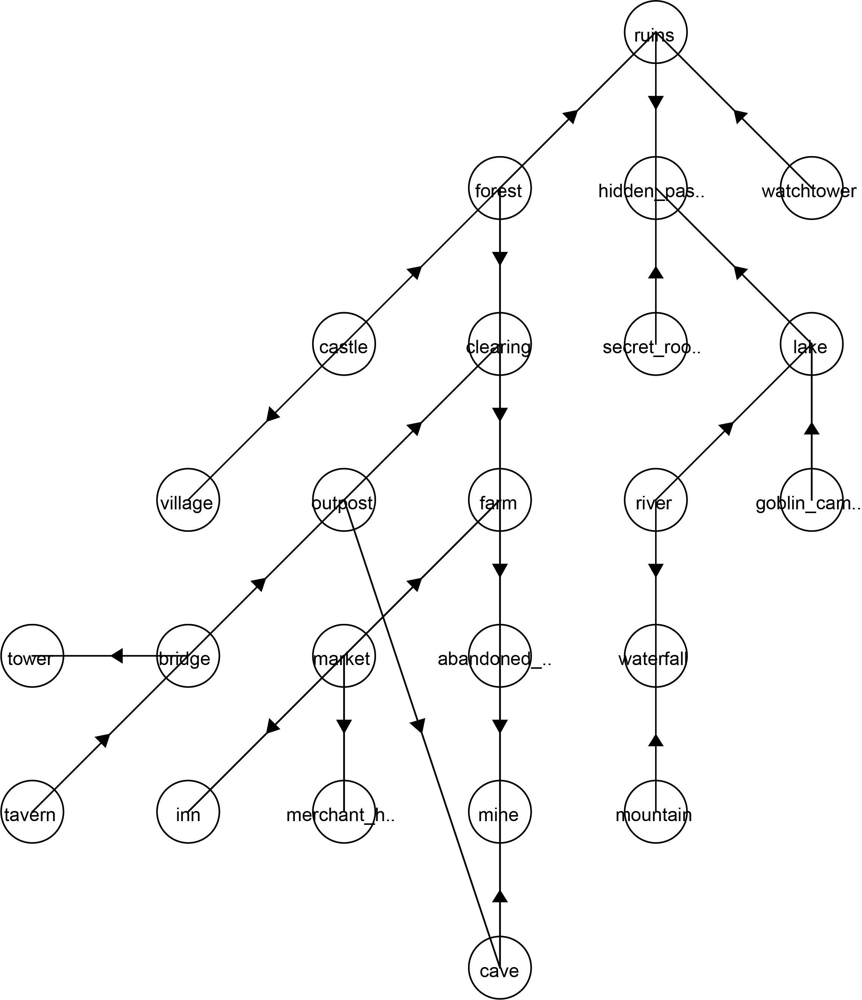

Graph2Image is a tool that can create SVG vector image files from a Graph. 
v1.0.0

#### Image Export:
Generates images in SGV vector format.
Default file locations for image exports, edge list imports, and exports are the same directory as the program.
Default image file name is Graph_0. If already exists, the name is incremented.

#### Design Logic:

It takes a list of the nodes that need to be drawn. Node1 and Node2 are connected. It checks if Node1 is the first node, and new root is made. It trys to see if Node1 is drawn already or not, if drawn already, it takes that location and finds a new location and draws Node2.   If Node1 is not drawn, but Node2 is drawn, it takes Nodes2's location and finds a location to draw Node1 as they are connected. Empty space is checked in an order: down, right, left, up. If no space is still found, it increases the gap size, and recursively searches again until found. If Node1 and 2 is not connected to anything already drawn, then new root is made a bit apart from the previous root. But this new root making gate is only open after one complete cycle of checking all the nodes in the list, to see if any nodes will connect with the currently drawn ones. Gate is closed again after making a new root. Basically, it will first try to draw all the conencted nodes, if a node is not connected to anything previously drawn, new root will be made, after a cycle of going through the list and drawing everyhting connected is completed.

#### Node Visualization:
Nodes are created gravitating downwards in a tree-like structure.
Arrows point towards the connected node, positioned at the center of each line.
The program may fail if node limt exceeds 60.
#### Import Edge List:
Edge lists need to be in .txt format.
Nodes should be separated by a space (" ").
Integer is expected for weight.
Content: Each line should contain three items: Node1 Node2 weight.
Export: Edge lists exported from the program follows the same format.
Example: Node1 Node2 10

#### Dependencies and libraries:

batik-parser-1.17.jar
batik-dom-1.17.jar
batik-xml-1.17.jar
batik-ext-1.17.jar
batik-extension-1.17.jar
batik-svggen-1.17.jar
batik-css-1.17.jar
batik-i18n-1.17.jar
batik-svg-dom-1.17.jar
batik-awt-util-1.17.jar
batik-constants-1.17.jar
xml-apis-1.4.01.jar
xml-apis-ext-1.3.04.jar
batik-util-1.17.jar
batik-anim-1.17.jar

https://xmlgraphics.apache.org/batik/download.html

## Run
Download the recent release, Graph2Image.JAR
Have JRE installed.

###Running using mac terminal:
chmod 755 Graph2Image.jar
java -jar Graph2Image.jar
